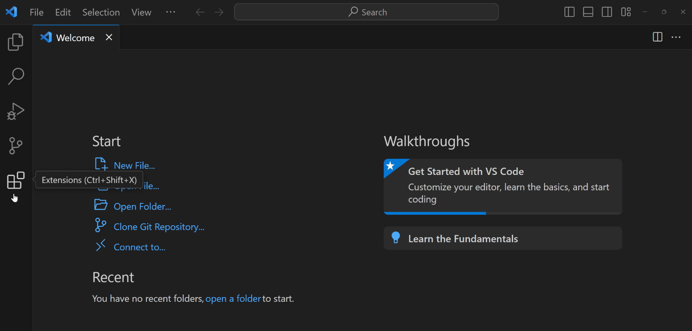

# Python

This repo shows how i learned python programming language.

## Python Installation

Multiple ways to run Python code, but VS Code reigns supreme as your multilingual coding companion

### VS Code:
Get started by installing:

• Open VS Code  
• Go to the Extension View or (Ctrl + Shift + X)  
• In the search bar, type "Python" by Microsoft and install it.  
  
  

After installation and other stuff, now you can run python code in your VS Code.  
  
